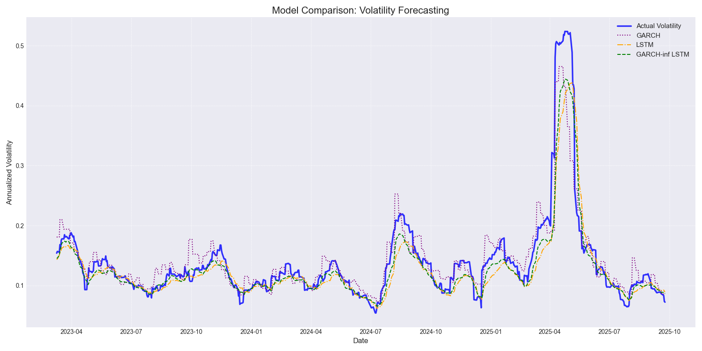
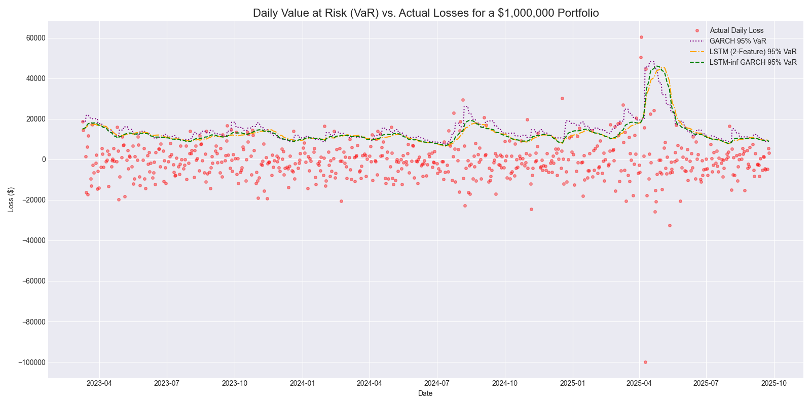

# Volatility Forecasting with GARCH, LSTM, and Hybrid Models

## Project Objective
This project compares three different models for volatility forecasting (realized volatility):
- GARCH models (more specifically GJR-GARCH)
- LSTM, long short term memory a type of RNN
- and finally a GARCH-informed LSTM (GARCH predictions is fed in as a feature)
- risk analysis with VaR (added 29/09/25)

---

## What it does

- Fetches raw SPY data from yahoo finance 
- engineer featurees to get meaningful features: realized_volaility, volume etc.
- forecast using GARCH, LSTM and a GARCH-informed LSTM
- return basic metrics and plot against predictions
- residual analysis

##  Results & Analysis

### forecast

The final comparison of all three models on the test set yielded the following results.

| Model               | RMSE   | MAE    | Correlation | 
|---------------------|--------|--------|-------------| 
| Optimized GARCH     | 0.0300 | 0.0189 | 0.9332      | 
| LSTM (2-Feature)    | 0.0331 | 0.0190 | 0.9226      | 
| Garch-Informed LSTM | 0.0271 | 0.0156 | 0.9603      | 

*a more detailed breakdown can be seen by running the individual python file of the model - 
above is just the results of
comparison.py*

### risk (VaR & CVaR)

for VaR the resuls were as follows:

| Model             | Breaches (out of 639) | Breach Rate | Expected Rate | CVaR (Expected loss upon breach) |
|-------------------|------------------------|-------------|---------------|----------------------------------|
| GARCH             | 29                     | 4.54%       | 5.00%         | $19,904.63                       |
| LSTM (2-Feature)  | 47                     | 7.36%       | 5.00%         | $18,147.53                       |
| LSTM-inf-GARCH    | 43                     | 6.73%       | 5.00%         | $18,657.95                       |

Evidently, GARCH had the lowest breach rate, followed by the LSTM-informed GARCH and then the 2-feature LSTM.
GARCH had the highest average loss upon breach (CVaR)

*run the calculating_risk.py file to see these results*

## Conclusion

while GARCH provides a good baseline, LSTM succeedes in learning non-linear patters and when GARCH is fed in
as a feature it performs so much better

The reason GARCH probably (well I think anyway) outperformed both LSTM's when it came to VaR was most likely because it was over-estimating
volatility a bit (during the forecast) quite which led to a higher VaR and price never breached those high levels. The reason it had the highest loss upon breach was
probably because it wasn't weighed down by moderate losses, unlike the LSTM models (which would've brought down their averages)

---

## Future Improvements / to do

- Add more features maybe? (VIX?)
- Experiment with more GARCH models
- Improve debugging (they're all print statements lmao)
- add notebooks under each model (explains ze math)
- more VaR methods?
- CVaR?