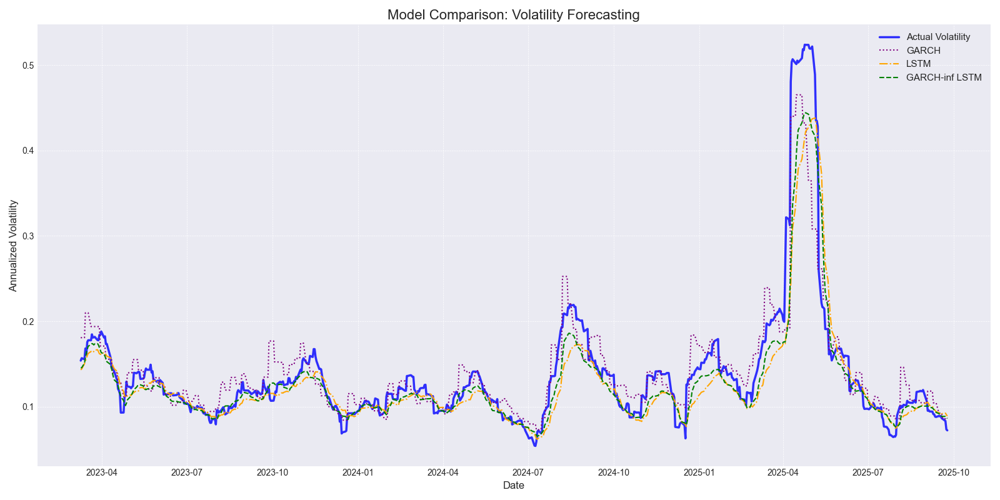

# Volatility Forecasting with GARCH, LSTM, and Hybrid Models

## Project Objective
This project compares three different models for volatility forecasting:
- GARCH models (more specifically GJR-GARCH)
- LSTM, long short term memory a type of RNN
- and finally a GARCH-informed LSTM (GARCH predictions is fed in as a feature)

all the models are plotted against 

---

## What it does

- Fetches raw SPY data from yahoo finance 
- engineer featurees to get meaningful features: realized_volaility, volume etc.
- forecast using GARCH, LSTM and a GARCH-informed LSTM
- return basic metrics and plot against predictions
- residual analysis

##  Results & Analysis

The final comparison of all three models on the test set yielded the following results.

| Model              | RMSE   | MAE    | Correlation | 
| ------------------ |--------|--------|-------------| 
| Optimized GARCH    | 0.0300 | 0.0189 | 0.9332      | 
| LSTM (2-Feature)   | 0.0331 | 0.0190 | 0.9226      | 
| Hybrid LSTM        | 0.0271 | 0.0156 | 0.9603      | 

*a more detailed breakdown can be seen by running the individual python file of the model - 
above is just the results of
comparison.py*

## Conclusion

while GARCH provides a good baseline, LSTM succeedes in learning non-linear patters and when GARCH is fed in
as a feature it performs so much better 

---

## Future Improvements / to do

- Add more features maybe? (VIX?)
- Experiment with more GARCH models
- Improve debugging (they're all print statements lmao)
- add notebooks under each model (explains ze math)
